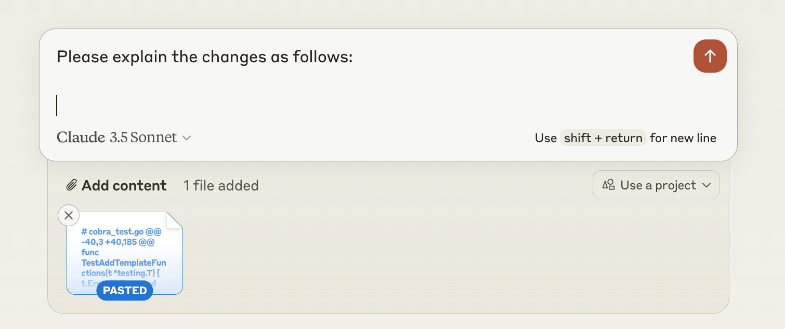

# ext-pr-diff
This tool is designed to be used for getting AI-generated explanations of code changes. It fetches GitHub Pull Request (PR) diffs and displays them in a markdown format, making it easy to input the changes into a generative AI system for analysis and explanation.

ext-pr-diff is a command-line tool to easily fetch and display GitHub Pull Request (PR) diffs in markdown format.

## Features

- Retrieve the list of changed files in a GitHub PR
- Display the diff for each file in markdown format
- Authenticate using GitHub CLI

## Prerequisites

Before you begin, ensure you have met the following requirements:

- [Go](https://golang.org/doc/install) (version 1.16 or later)
- [GitHub CLI](https://cli.github.com/)

## Installation

1. Clone the repository:
`git clone https://github.com/danimal141/ext-pr-diff.git`

2. Navigate to the project directory:

`cd ext-pr-diff`

3. Build the tool:

`go build -o bin/ext-pr-diff`

## Usage

1. Authenticate with GitHub CLI (if you haven't already):

`gh auth login`

2. Run the tool:

`./ext-pr-diff --link <PR_LINK>`

Or use short flag:

`./ext-pr-diff -l <PR_LINK>`

Example:

`./ext-pr-diff -l https://github.com/danimal141/ext-pr-diff/pull/1`

3. The diff for each file in the PR will be displayed in markdown format.

## Options

- `--link`, `-l`: GitHub Pull Request link (required)
- `--help`, `-h`: Display help message

## Example
`bin/ext-pr-diff -l https://github.com/spf13/cobra/pull/2094`

This command will fetch the diff for Pull Request #2094 in the spf13/cobra repository. The output will look similar to this:

<details>
<summary>Click to expand the diff output</summary>

```diff
# cobra_test.go
@@ -40,3 +40,185 @@ func TestAddTemplateFunctions(t *testing.T) {
                t.Errorf("Expected UsageString: %v\nGot: %v", expected, got)
        }
 }
+
+func TestLevenshteinDistance(t *testing.T) {
+       tests := []struct {
+               name       string
+               s          string
+               t          string
+               ignoreCase bool
+               expected   int
+       }{
+               {
+                       name:       "Equal strings (case-sensitive)",
+                       s:          "hello",
+                       t:          "hello",
+                       ignoreCase: false,
+                       expected:   0,
+               },
+               {
+                       name:       "Equal strings (case-insensitive)",
+                       s:          "Hello",
+                       t:          "hello",
+                       ignoreCase: true,
+                       expected:   0,
+               },
+               {
+                       name:       "Different strings (case-sensitive)",
+                       s:          "kitten",
+                       t:          "sitting",
+                       ignoreCase: false,
+                       expected:   3,
+               },
+               {
+                       name:       "Different strings (case-insensitive)",
+                       s:          "Kitten",
+                       t:          "Sitting",
+                       ignoreCase: true,
+                       expected:   3,
+               },
+               {
+                       name:       "Empty strings",
+                       s:          "",
+                       t:          "",
+                       ignoreCase: false,
+                       expected:   0,
+               },
+               {
+                       name:       "One empty string",
+                       s:          "abc",
+                       t:          "",
+                       ignoreCase: false,
+                       expected:   3,
+               },
+               {
+                       name:       "Both empty strings",
+                       s:          "",
+                       t:          "",
+                       ignoreCase: true,
+                       expected:   0,
+               },
+       }
+
+       for _, tt := range tests {
+               t.Run(tt.name, func(t *testing.T) {
+                       // Act
+                       got := ld(tt.s, tt.t, tt.ignoreCase)
+
+                       // Assert
+                       if got != tt.expected {
+                               t.Errorf("Expected ld: %v\nGot: %v", tt.expected, got)
+                       }
+               })
+       }
+}
+
+func TestStringInSlice(t *testing.T) {
+       tests := []struct {
+               name     string
+               a        string
+               list     []string
+               expected bool
+       }{
+               {
+                       name:     "String in slice (case-sensitive)",
+                       a:        "apple",
+                       list:     []string{"orange", "banana", "apple", "grape"},
+                       expected: true,
+               },
+               {
+                       name:     "String not in slice (case-sensitive)",
+                       a:        "pear",
+                       list:     []string{"orange", "banana", "apple", "grape"},
+                       expected: false,
+               },
+               {
+                       name:     "String in slice (case-insensitive)",
+                       a:        "APPLE",
+                       list:     []string{"orange", "banana", "apple", "grape"},
+                       expected: false,
+               },
+               {
+                       name:     "Empty slice",
+                       a:        "apple",
+                       list:     []string{},
+                       expected: false,
+               },
+               {
+                       name:     "Empty string",
+                       a:        "",
+                       list:     []string{"orange", "banana", "apple", "grape"},
+                       expected: false,
+               },
+               {
+                       name:     "Empty strings match",
+                       a:        "",
+                       list:     []string{"orange", ""},
+                       expected: true,
+               },
+               {
+                       name:     "Empty string in empty slice",
+                       a:        "",
+                       list:     []string{},
+                       expected: false,
+               },
+       }
+
+       for _, tt := range tests {
+               t.Run(tt.name, func(t *testing.T) {
+                       // Act
+                       got := stringInSlice(tt.a, tt.list)
+
+                       // Assert
+                       if got != tt.expected {
+                               t.Errorf("Expected stringInSlice: %v\nGot: %v", tt.expected, got)
+                       }
+               })
+       }
+}
+
+func TestRpad(t *testing.T) {
+       tests := []struct {
+               name        string
+               inputString string
+               padding     int
+               expected    string
+       }{
+               {
+                       name:        "Padding required",
+                       inputString: "Hello",
+                       padding:     10,
+                       expected:    "Hello     ",
+               },
+               {
+                       name:        "No padding required",
+                       inputString: "World",
+                       padding:     5,
+                       expected:    "World",
+               },
+               {
+                       name:        "Empty string",
+                       inputString: "",
+                       padding:     8,
+                       expected:    "        ",
+               },
+               {
+                       name:        "Zero padding",
+                       inputString: "cobra",
+                       padding:     0,
+                       expected:    "cobra",
+               },
+       }
+
+       for _, tt := range tests {
+               t.Run(tt.name, func(t *testing.T) {
+                       // Act
+                       got := rpad(tt.inputString, tt.padding)
+
+                       // Assert
+                       if got != tt.expected {
+                               t.Errorf("Expected rpad: %v\nGot: %v", tt.expected, got)
+                       }
+               })
+       }
+}
```



</details>


## Contributing

Contributions to ext-pr-diff are welcome! Here's how you can contribute:

1. Fork the repository
2. Create a new branch (`git checkout -b feature/AmazingFeature`)
3. Make your changes
4. Commit your changes (`git commit -m 'Add some AmazingFeature'`)
5. Push to the branch (`git push origin feature/AmazingFeature`)
6. Open a Pull Request

Please ensure your code adheres to the existing style to maintain consistency.

## Bug Reports and Feature Requests

If you encounter any bugs or have ideas for new features, please [open an issue](https://github.com/danimal141/ext-pr-diff/issues) on GitHub.

## License

This project is licensed under the MIT License - see the [LICENSE](LICENSE) file for details.

## Acknowledgements

- [Cobra](https://github.com/spf13/cobra) - A Commander for modern Go CLI interactions
- [GitHub CLI](https://cli.github.com/) - GitHub's official command line tool
